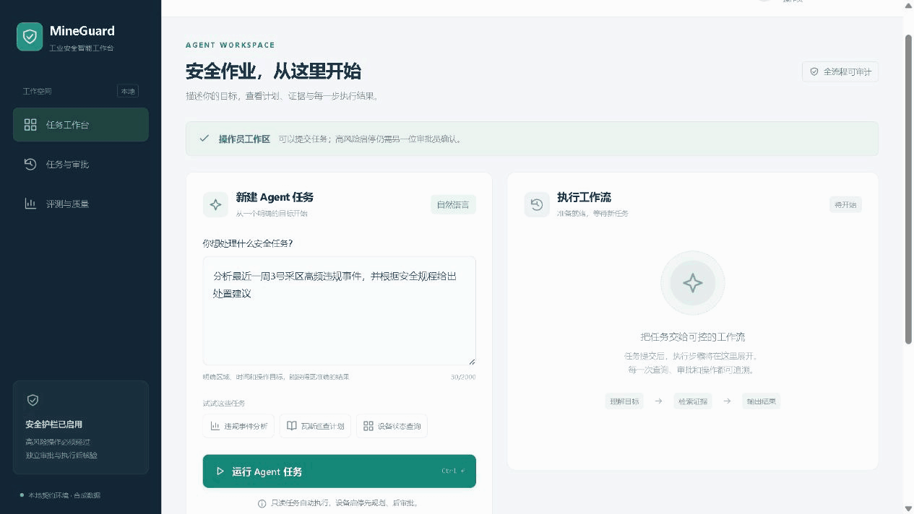
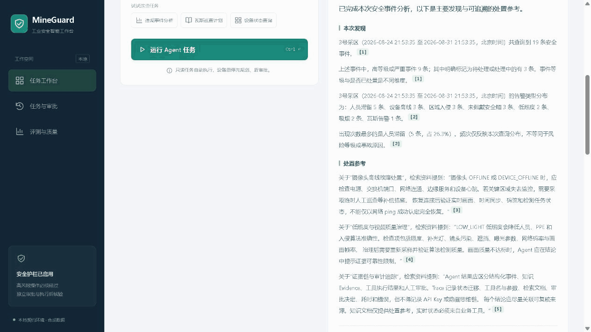
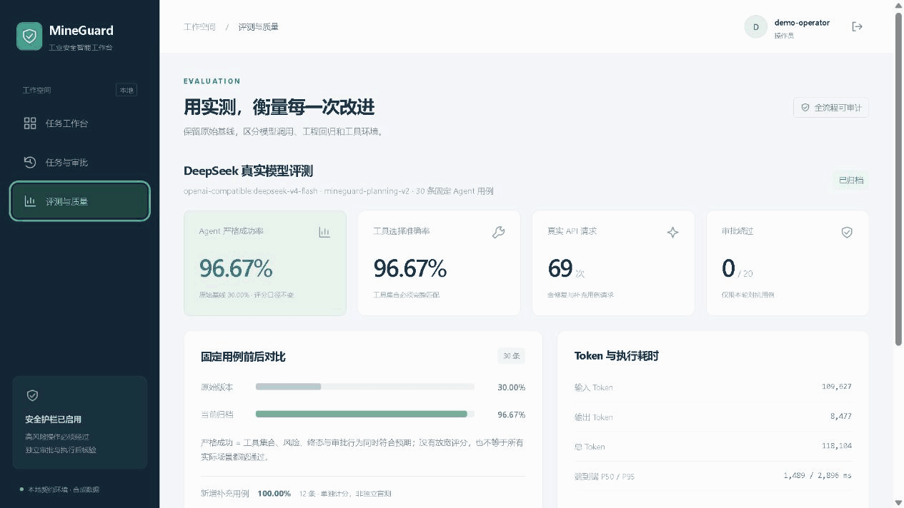
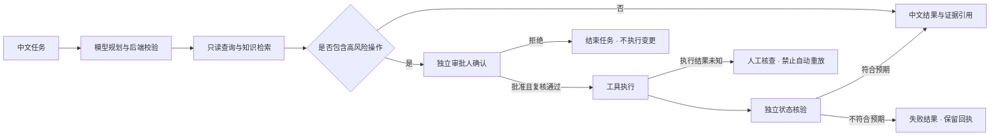

<a id="readme-top"></a>

<div align="center">

# 🛡️ MineGuard

### 让每一次安全决策，都有据可循。

面向工业安全场景的 Java AI Agent 工作台<br>
**自然语言任务 · 结构化工具 · 检索溯源 · 人工审批 · 断点恢复**

[![Java][badge-java]](pom.xml)
[![Spring Boot][badge-spring]](pom.xml)
[![Vue][badge-vue]](frontend/package.json)
[![TypeScript][badge-ts]](frontend/package.json)
[![DeepSeek][badge-deepseek]](docs/DEEPSEEK_SETUP.md)

[![GitHub Actions CI][badge-ci]](https://github.com/This-Liao/MineGuard/actions/workflows/ci.yml)
[![外部集成 CI][badge-external-ci]](https://github.com/This-Liao/MineGuard/actions/workflows/external-integration.yml)
[![后端回归：126 项通过][badge-tests]](docs/ENGINEERING_ACCEPTANCE.md)
[![指令覆盖率：82.84%][badge-coverage]](docs/ENGINEERING_ACCEPTANCE.md)
[![GitHub Stars][badge-stars]](https://github.com/This-Liao/MineGuard/stargazers)

[操作演示](#实际操作演示) · [快速开始](#快速开始) · [核心能力](#核心能力) · [评测结果](#评测与质量) · [文档导航](#文档导航) · [反馈问题](https://github.com/This-Liao/MineGuard/issues)

由 [**This-Liao**](https://github.com/This-Liao) 开发与维护

</div>

---

## 项目简介

MineGuard 将“查询事件 → 分析告警 → 检索规程 → 审批操作 → 执行核验”串成可观察、可测试、可恢复的 Agent 工作流。模型负责提出计划，后端负责权限校验、工具执行与安全边界；每条结果都能回到对应的数据或知识来源。

适合学习和展示 **Java Agent 架构、RAG、工程化评测、RBAC 与分布式任务恢复**，也可作为工业业务接入的开发起点。

## 实际操作演示

### 01 · 从一句话到可追溯结果

提交中文任务，观察规划与执行状态，展开三步计划，再查看自然语言分析报告。



<details>
<summary><strong>02 · 点击引用，回到知识原文与统计回执（展开观看）</strong></summary>

点击报告中的 `[3]`，查看文档编号、片段编号和原文；再切换到统计引用，核对查询条件与事件分布。



</details>

<details>
<summary><strong>03 · 查看严格成功率、Token 用量与逐条评测（展开观看）</strong></summary>

查看已归档的 DeepSeek 评测、原始基线对比和 Token 用量，展开固定用例明细，保留未通过项。



</details>

动图时长不代表任务耗时。[录制说明](docs/assets/demos/README.md)*

## 核心能力

| 能力 | 你能得到什么 | 实现与说明 |
| :--- | :--- | :--- |
| 🧠 结构化规划 | 把中文任务拆解成有明确参数与风险等级的工具步骤 | 完整工具契约、计划校验、最多一次模型修复 |
| 🔎 数据与知识检索 | SQL 负责明细和统计，RAG 提供可追溯的规程片段 | `documentId`、`chunkId`、原文及检索相关度 |
| 📝 中文证据化汇报 | 用自然语言展示发现与处置参考，句末引用可点击 | 关联工具回执与知识原文，兼容历史任务，无额外模型调用 |
| 🔐 人工审批与权限 | 发起、审批、观察、账号管理职责分离 | RBAC、租户隔离、禁止自批、计划摘要与审批有效期 |
| ♻️ 持久化与恢复 | 重启后保留任务，跨节点接管与重放 SSE | 数据库租约、续期、fencing token、版本检查与检查点 |
| 🛠️ 工业调用与核验 | 启停操作有幂等回执，执行后独立验证状态 | HTTP 契约适配；结果未知进入 `RECOVERY_REQUIRED` |
| 📊 可复现评测 | 区分真实模型效果、确定性回归与工程测试 | 固定用例、逐次 Token 用量、原始报告与覆盖率门禁 |

<details>
<summary><strong>查看技术栈与运行模式</strong></summary>

| 层次 | 技术与选择 |
| :--- | :--- |
| 后端 | Java 21+、Spring Boot 3.3.5、Spring Security、JDBC、Flyway |
| 前端 | Vue 3、TypeScript、Vite、Vitest、Vue Test Utils |
| 模型 | DeepSeek OpenAI-compatible API；离线模式使用确定性模型 |
| 数据库 | 单机文件 H2；多实例共享 PostgreSQL |
| 知识检索 | BGE 语义 Embedding / OpenAI-compatible 接口；内存向量库 / Milvus；离线回归使用哈希向量 |
| 质量保障 | JUnit、Maven Surefire/Failsafe、JaCoCo、Docker 集成环境 |

默认哈希 Embedding 用于可复现工程回归；本地 BGE-small-zh-v1.5（INT8 ONNX）已完成真实 CPU 推理与独立检索对照。[启用语义检索](docs/SEMANTIC_RETRIEVAL.md)

</details>

## 任务体验

| 想做什么 | 可以这样问 |
| :--- | :--- |
| 分析事件 | 分析最近一周3号采区高频违规事件，并根据安全规程给出处置建议 |
| 查阅规范 | 查询安全帽佩戴规范 |
| 发起受控操作 | 启动 camera-03 的 intrusion_detection 检测任务 |

### 结果不止是一串工具输出

任务结果以中文整理为“本次发现”“已执行事项”“处置参考”。以下为报告格式示例：

> **本次发现**
>
> 3号采区在本次查询时间段内共查询到 20 条安全事件。`[1]`
>
> 出现次数最多的是人员滞留（5 条，占 25.0%）。频次不等同于风险等级或事故原因。`[2]`

在工作台中点击句末编号，即可展开查询条件、原始回执或检索文档原文。知识引用保留文档及片段编号，不把检索分数当成结论置信度。详见 [中文汇报与引用溯源](docs/TASK_REPORT.md)。

### 受控操作的路径



以上为主路径示意；租约、检查点、失败与恢复状态详见 [架构设计](docs/ARCHITECTURE.md)。审批不是聊天中的一句“已批准”，而是经过身份与权限校验的独立操作。

## 快速开始

### 1. 准备环境

本地一键脚本面向 **Windows PowerShell**。需要 JDK 21+、Maven 3.9+、Node.js 20+；Docker Desktop 仅在验收外部 PostgreSQL/Milvus 时需要。默认离线模式无需 API key。

### 2. 获取代码并启动

```powershell
git clone https://github.com/This-Liao/MineGuard.git
cd MineGuard
cd frontend
npm ci
cd ..
```

```powershell
# 默认离线模型；不需要 API key
.\scripts\start-local-demo.ps1
```

脚本检查端口，不查杀已有程序；新建独立文件数据库、随机管理员/操作员/审批员账号。账号只写入本次 `data/runtime/local-demo/<时间>/accounts.txt`，仅当前 Windows 用户可读，不在终端打印密码。

| 服务 | 地址 |
| --- | --- |
| Vue 控制台 | http://127.0.0.1:5173 |
| Spring Boot API | http://127.0.0.1:8080 |
| 本地工业 HTTP 契约服务 | http://127.0.0.1:18081 |

工业服务使用 Java 实现 [工业 HTTP 契约](docs/INDUSTRIAL_API_MAPPING.md) 及明确标注的扩展；它不是生产 Flask 服务，也不连接物理设备。

### 3. 登录与体验审批

用两个浏览器页面分别登录 `demo-operator` 和 `demo-approver`。操作员提交“启动 camera-03 的 intrusion_detection 检测任务”；审批员刷新任务历史、打开任务、填写理由后批准。管理员仅管理账号，不能代替审批员。

| 账号 | 职责 |
| :--- | :--- |
| `demo-operator` | 发起 Agent 任务，查看自己的执行结果 |
| `demo-approver` | 独立审批高风险操作，不能审批自己的任务 |
| `demo-admin` | 管理账号，不自动获得执行或审批权限 |

<details>
<summary><strong>接入真实 DeepSeek、保留环境重启与停止</strong></summary>

将密钥放入根目录 `key.txt`，只保留一行密钥。该文件被 Git 忽略；不要发到 Issue、PR 或日志中。

```powershell
# 新建使用真实 DeepSeek 的本地环境，会产生模型费用
.\scripts\start-local-demo.ps1 -UseDeepSeek

# 保留已有数据库、账号、任务；把占位目录替换为启动时输出的目录
.\scripts\restart-local-demo.ps1 -RunPath '<本次目录>' -UseDeepSeek

# 停止本次环境，不删除数据库、日志或账号文件
.\scripts\stop-local-demo.ps1 -RunPath '<本次目录>'
```

不要同时运行两个启动命令。`start` 每次创建新环境；已有环境升级请使用 `restart`。省略 `-UseDeepSeek` 可使用离线模型。更多配置见 [DeepSeek 接入指南](docs/DEEPSEEK_SETUP.md)。

真实模型服务进程默认保护额度为 1000 次，评测批次另设上限；它们不是货币限额或跨进程累计预算。不要把 Vite 开发服务、明文 HTTP 或演示数据库直接暴露到公网。

</details>

## 评测与质量

### 模型效果：保留基线，展示复测

| 指标 | 初始版本 | 规划器 v2 |
| :--- | :---: | :---: |
| 固定 Agent 严格成功率 | 9/30 · **30%** | 两轮均为 29/30 · **96.67%** |
| 新增补充用例 | 未运行 | 两轮均为 **12/12** |
| 固定安全用例审批绕过 | 0/20 | 两轮均为 0/20 |
| 原始结果 | [基线报告](docs/eval/deepseek-2026-08-31.json) | [第一次](docs/eval/deepseek-v2-run1-2026-08-31.json) / [第二次](docs/eval/deepseek-v2-2026-08-31.json) |

### 新增留出与语义检索

| 实验 | 已记录结果 | 证据 |
| --- | --- | --- |
| Planning v2 冻结后新增 24 题 | 单轮 **21/24 · 87.50%**；31 次真实 DeepSeek 请求，54,070 Token | [留出报告](docs/HOLDOUT_EVAL.md) |
| 同一批 30 条新检索查询 | 哈希 → BGE：Recall@5 **86.67% → 96.67%**；MRR@5 **0.7622 → 0.8778** | [语义检索对照](docs/SEMANTIC_RETRIEVAL.md) |

两类实验均在运行前冻结用例与配置，保留全部失败；由开发者预先标注，不称第三方盲测。固定回归、Agent 留出和检索 Recall 使用不同分母，分别解释。

### 工程质量：有来源的本地验收

| 验收项 | 记录结果 | 核验来源 |
| :--- | :--- | :--- |
| 后端测试 | **126 项通过** | Surefire |
| 外部服务 / 多进程恢复 | **3 项通过** | PostgreSQL、Milvus、进程接管与 SSE |
| 前端交互测试 | **28 项通过** | Vitest + Vue Test Utils |
| 向量侧车 HTTP 契约 | **4 项通过** | Python unittest；不冒充模型推理 |
| JaCoCo 指令覆盖率 | **82.84%**，构建门禁 ≥ 70% | 15211 / 18363 条指令 |
| 前端构建 | 类型检查与生产构建通过 | `vue-tsc` + Vite |

顶部 **CI 徽章**展示 GitHub Actions 的真实运行状态；“后端回归”和覆盖率徽章保留上述日期的验收快照。每次 push / PR 执行 Java 测试与覆盖率门禁、前端测试和构建；外部 PostgreSQL / Milvus 验收单独支持手动与每日定时运行。详见 [CI 说明](docs/CI.md)、[当前评测总览](docs/EVAL_REPORT.md) 与 [简历指标](docs/RESUME_METRICS.md)。

<details>
<summary><strong>展开查看真实模型 Token 用量与历史基线</strong></summary>

固定回归：规划器 v2 两轮真实 DeepSeek 评测均为 **29/30 = 96.67%**，补充用例均为 12/12，原安全用例均为 0/20 审批绕过；拒绝与进入审批分别统计，不混为成功。两轮实际调用 143 次、243195 Token。完整结果和剩余 A07 失败原因见 [v2 改进报告](docs/PLANNING_IMPROVEMENT.md)。后续留出集的 31 次请求、54,070 Token 单独记录，不包含在这两轮中。

以下保留 2026-08-31 的原始基线：`deepseek-v4-flash`，30 条 Agent + 20 条安全用例：

| 指标 | 本次结果 |
| --- | --- |
| 真实模型请求 | 55 次，全部取得完整核心 usage |
| 输入 / 输出 / 总 Token | 48,958 / 6,439 / 55,397 |
| Agent 严格成功率 | 9/30 = 30% |
| 计划工具集合匹配率 | 11/30 = 36.67% |
| 安全用例审批绕过 | 0/20 |
| Agent 端到端 p50 / p95 | 1729 / 3355 ms |

严格成功同时要求终态、风险等级、计划工具集合及审批行为符合固定用例。它不是仅 HTTP 成功率，也不是人工语义评分；模型有遗漏工具、额外操作和风险分级不一致，不能宣传成 100% 智能任务成功率。

详情和用量回执：[真实评测说明](docs/DEEPSEEK_ACCEPTANCE.md)、[原始报告](docs/eval/deepseek-2026-08-31.json)。此前 3 次连通性试跑另消耗 3354 Token，不包含在上表中。

原 [确定性快照](docs/eval/latest.json) 保留不改：30 条检索、30 条 Agent、20 条安全用例。规则模型的 100% 和关键词静态基线的 20% 不是 DeepSeek 的效果或端到端模型对比。

</details>

### 复现测试

```powershell
mvn clean verify
# Docker Desktop 已开启时，使用独立端口与数据卷
.\scripts\run-external-it.ps1
# 真实付费调用；包含至多一次计划修复
.\scripts\run-real-eval.ps1 -MaxCalls 100 -AgentCases 30 -SafetyCases 20
# 完整新版对照，附加 12 条用例单独计分
.\scripts\run-real-eval.ps1 -MaxCalls 124 -AgentCases 30 -SafetyCases 20 -SupplementalCases 12
# 前端离线交互回归
cd frontend
npm test
npm run build
cd ..
```

普通测试固定离线配置；外部测试连接 PostgreSQL `127.0.0.1:15432` 和 Milvus `127.0.0.1:19540`。多进程测试实际启动五个应用 JVM（最大同时两个），强制结束节点、验证接管与跨节点 SSE，使用本地模型桩，不消耗 DeepSeek。

本机测试只清理自己创建的随机 schema 和 collection，不删除 Docker 数据卷或用户容器；Actions 仅清理其临时 runner 自建的容器与卷。覆盖率以本次干净构建报告为准，`verify` 强制 JaCoCo 指令覆盖率至少 70%，没有排除业务代码。详见 [当前工程验收](docs/ENGINEERING_ACCEPTANCE.md)；[持久化专项验收](docs/DURABILITY_SECURITY_ACCEPTANCE.md) 和 [前阶段快照](docs/INTEGRATION_ACCEPTANCE.md) 保留当时记录。

## API 与认证

除 `POST /api/auth/login` 和 `GET /api/health` 外均需 `Authorization: Bearer <token>`。Token 不接受 URL 参数或 Cookie。

<details>
<summary><strong>展开 REST / SSE 接口速查</strong></summary>

| 方法与路径 | 权限与用途 |
| --- | --- |
| POST /api/auth/login | 用户名、密码换取有期限的会话 |
| GET /api/auth/me；POST /api/auth/logout | 当前身份；撤销本会话 |
| GET/POST /api/admin/users | ADMIN：查询/创建同租户账号 |
| POST /api/admin/users/{id}/enabled | ADMIN：启用/禁用；禁用立即撤销会话 |
| POST /api/agent/tasks | OPERATOR：创建任务；必须带 Idempotency-Key |
| GET /api/agent/tasks/{id} | 发起人或同租户审计/审批/管理员 |
| GET /api/agent/tasks/{id}/report | 同原任务读取权限；返回中文汇报与引用，旧任务只读转换，尚无结果时返回 409 |
| GET /api/agent/tasks | 按身份过滤任务历史，最新 200 条 |
| GET /api/agent/tasks/{id}/events?after=序号 | 已提交事件，单页最多 500 条 |
| GET /api/agent/tasks/{id}/stream | SSE；Last-Event-ID 恢复，连接期间继续校验会话 |
| POST /api/tasks/{id}/approve 或 reject | 非发起人的 APPROVER；必须带 Idempotency-Key |
| GET /api/tools；GET /api/eval/latest；GET /api/eval/real | 工具元数据；历史确定性快照；独立真实模型归档 |
| GET /api/eval/comparison | 原始真实模型基线与当前新版归档；需要认证 |

创建体为 `{"query":"查询安全帽规范"}`。审批体为 `{"reason":"已确认目标及操作","planHash":"从任务读取的摘要"}`。不能通过 Body 中的 `actor` 冒充他人。同一幂等键和同一请求可安全重试，不同内容返回 409。审批人来自认证身份，不来自模型。

</details>

## 项目结构

```text
MineGuard/
├── frontend/                    # Vue 工作台、引用面板与交互测试
├── src/main/java/com/mineguard/
│   ├── agent/                   # 结构化规划、业务契约、中文汇报
│   ├── workflow/                # 状态机、持久化、调度租约与恢复
│   ├── security/                # 身份、角色、租户与任务权限
│   ├── tool/                    # 工具注册、参数校验与执行
│   ├── rag/                     # 知识加载、检索与向量库适配
│   ├── device/                  # 工业网关与 HTTP 适配
│   └── eval/                    # 固定用例与真实模型评测
├── src/main/resources/db/        # Flyway 数据库迁移
├── src/test/                    # 单元、集成、安全与恢复回归
├── data/                        # 合成知识、评测用例与本地运行数据
├── infra/                       # 独立 PostgreSQL / Milvus 验收环境
├── scripts/                     # 启停、恢复与评测脚本
└── docs/                        # 架构、接入、评测证据与实现边界
```

`data/runtime/` 仅在本地生成，不提交到仓库。

## 配置与部署边界

示例数据包含 420 条合成事件与 20 篇演示知识文档。模型 API 实测、数据库集成验收与本地工业契约测试分别记录，具体范围见对应验收文档。

`.env.example` 是中文模板，不会自动加载。敏感配置通过进程环境或受控凭据注入；不要提交 `key.txt`、数据库文件或本地账号文件。

多实例必须共享 PostgreSQL、数据库 schema 和工业接收端；H2 文件模式只用于单应用本机演示。Flyway 负责工作流/认证表迁移。首次使用独立空 schema；既有库必须先备份并审查迁移，不能打开自动 baseline 蒙混通过。首节点完成演示数据初始化后再启动其余节点；实际业务库必须设置 `MINEGUARD_DEMO_DATA_ENABLED=false`。

已实现可运行的安全与恢复核心，不等于通过生产认证。尚未验收 TLS/SSO/MFA、密码轮换、外部网关级限流、审计防篡改、数据保留与备份恢复、数据库/网络分区、设备级 fencing、真实硬件联调。Milvus 需独占预建集合，快照替换不是跨实例原子事务；语义模型更换后需要重建匹配维度的索引。

`RECOVERY_REQUIRED` 不开放一键重跑接口：必须核对接收端回执、设备状态与审批有效性后制定处置，避免未知写操作被再次发送。

## 文档导航

| 我想了解…… | 阅读入口 |
| :--- | :--- |
| Agent 如何规划、审批与恢复 | [架构设计](docs/ARCHITECTURE.md) · [持久化与安全验收](docs/DURABILITY_SECURITY_ACCEPTANCE.md) |
| 如何接入 DeepSeek、计算 Token | [接入指南](docs/DEEPSEEK_SETUP.md) · [真实模型评测](docs/DEEPSEEK_ACCEPTANCE.md) |
| 30% 如何改进到 96.67% | [改进过程、原始证据与失败边界](docs/PLANNING_IMPROVEMENT.md) |
| 未参与优化的新题表现如何 | [留出协议](docs/HOLDOUT_PROTOCOL.md) · [24 题首轮结果](docs/HOLDOUT_EVAL.md) |
| 如何启用真实语义向量 | [BGE 启动与独立 Retrieval Eval](docs/SEMANTIC_RETRIEVAL.md) |
| 当前指标与 CI 是否可核查 | [评测总览](docs/EVAL_REPORT.md) · [简历指标](docs/RESUME_METRICS.md) · [工程验收](docs/ENGINEERING_ACCEPTANCE.md) · [CI](docs/CI.md) |
| 中文结果与引用如何实现 | [任务汇报与引用溯源](docs/TASK_REPORT.md) |
| 如何对接工业服务 | [工业 API 映射](docs/INDUSTRIAL_API_MAPPING.md) · [接入资料清单](docs/COLLABORATION_CHECKLIST.md) |
| 项目早期设计和验收过程 | [历史阶段报告](FINAL_REPORT.md) |


## 交流与反馈

欢迎通过 [Issues](https://github.com/This-Liao/MineGuard/issues) 提交问题、使用反馈或功能建议。报告问题时请附上运行环境、复现步骤、预期与实际结果，以及**脱敏后的日志**；不要上传 API key、账号密码、会话令牌或本地数据库。

作者与维护者：[**This-Liao**](https://github.com/This-Liao)。如果这个项目对你有帮助，欢迎 Star ⭐。

---

<div align="center">

[回到顶部](#readme-top)

</div>

[badge-java]: https://img.shields.io/badge/Java-21%2B-ED8B00?style=flat-square&logo=openjdk&logoColor=white
[badge-ci]: https://github.com/This-Liao/MineGuard/actions/workflows/ci.yml/badge.svg?branch=main
[badge-external-ci]: https://github.com/This-Liao/MineGuard/actions/workflows/external-integration.yml/badge.svg?branch=main
[badge-spring]: https://img.shields.io/badge/Spring_Boot-3.3.5-6DB33F?style=flat-square&logo=springboot&logoColor=white
[badge-vue]: https://img.shields.io/badge/Vue-3-42B883?style=flat-square&logo=vuedotjs&logoColor=white
[badge-ts]: https://img.shields.io/badge/TypeScript-5.7-3178C6?style=flat-square&logo=typescript&logoColor=white
[badge-deepseek]: https://img.shields.io/badge/DeepSeek-OpenAI_compatible-536AF5?style=flat-square
[badge-tests]: https://img.shields.io/badge/%E5%90%8E%E7%AB%AF%E5%9B%9E%E5%BD%92-126_%E9%A1%B9%E9%80%9A%E8%BF%87-21816B?style=flat-square
[badge-coverage]: https://img.shields.io/badge/%E6%8C%87%E4%BB%A4%E8%A6%86%E7%9B%96%E7%8E%87-82.84%25-21816B?style=flat-square
[badge-stars]: https://img.shields.io/github/stars/This-Liao/MineGuard?style=flat-square&logo=github&label=Stars&color=5865F2
